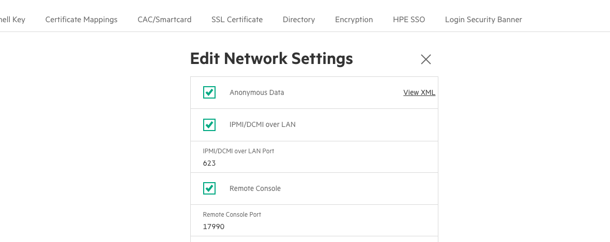

# Configure the BMC for UANs with iLO

Enable IPMI/DCMI on an HPE UAN with an iLO.

Perform the first three steps of [Prepare for UAN Product Installation](Prepare_for_UAN_Product_Installation.md).

- **OBJECTIVE**

    Enable the IPMI/DCMI settings on an HPE UAN that are necessary to continue UAN product installation on an HPE Cray EX supercomputer.

1. Create the SSH tunnel necessary to access the BMC web GUI interface.

    1. Find the IP or hostname for a UAN.

    2. Create an SSH tunnel to the UAN BMC.

        In the following example, `uan01-mgmt` is the UAN and `shasta-ncn-m001` is the NCN the admin is logged into.

        ```bash
        # ssh -L 8443:uan01-mgmt:443 shasta-ncn-m001
        ```

    3. Wait for SSH to establish the connection.

2. Open <https://127.0.0.1:8443> in web browser on the NCN to access the BMC web GUI.

3. Log in to the web GUI using default credentials.

4. Click **Security** in the menu on the left side of the screen.

5. Click Access Settings in the menu at the top of the screen.

6. Click the pencil icon next to **Network** in the main window area.

7. Check the box next to **IPMI/DCMI over LAN**.

8. Ensure that the remove management settings match the following screenshot.

    
