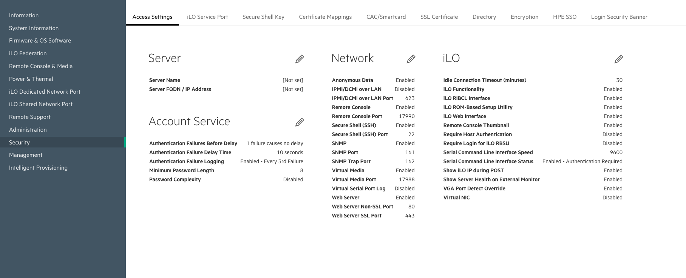

# Cray EX User Access Node Installation Prerequisites

> version: @product_version@
>
> build date: @date@

This section describes the prerequisites for installing and operating User
Access Nodes (UAN) on Cray EX systems.

---

## Contents

* [Management Network Switch Configuration](#switchprereq)
* [BMC Configuration](#bmcconfig)
  * [HPE/iLO-based UAN nodes](#bmcconfig-hpe)
* [BIOS configuration](#biosconfig)
  * [HPE/iLO-based UAN nodes](#biosconfig-hpe)
  * [Gigabyte-based UAN nodes](#biosconfig-gig)
* [UAN BMC Firmware](#uanfw)
* [Software Prerequisites](#swprereq)

---

<a name="switchprereq"></a>
## Management Network Switch Configuration

1. Ensure that the management network switches are properly configured and have
   the proper firmware. See CSM installation documentation, sections 400-499.

1. Ensure that the host reservations for the UAN CAN network have been properly set.
    ##FIXME## (Dat Le) Reference to procedure for Querying SLS and updating SLS for the UAN CAN IP used for bonded interfaces
    ##FIXME## This is a "fix" and not a CSM documented (i.e. numbered section). How do we reference it.

<a name="bmcconfig"></a>
## BMC Configuration

<a name="bmcconfig-hpe"></a>
### HPE/iLO-based UAN nodes

To verify the BMC configuration of each UAN node, you must first establish a SSH
tunnel in order to access the BMC web GUI interface.

1. Find the IP or hostname for each UAN node:

        # UAN_HOST=uan01-mgmt

1. Create a tunnel to the UAN BMC:

        # HOST=shasta-ncn-m001
        # ssh -L 8443:$UAN_HOST:443 $HOST

1. After the connection is established, visit `https://127.0.0.1:8443` in your
   local browser to access the BMC web GUI. Login to the web GUI using default
   credentials, and then verify the IPMI setting and user settings using the
   steps below.

1. On the "main page" edit the Network settings under the Security (side menu)
   Access Settings (top menu) and click the pencil next to the Network heading.

   

1. Check IPMI/DCMI over LAN is enabled:

   

<a name="biosconfig"></a>
## BIOS configuration

<a name="biosconfig-hpe"></a>
### HPE/iLO-based UAN nodes

1. Force the node to reboot into BIOS with the following command. `$HOST` is the
   hostname (xname) of the BMC of the node to configure.

   ```bash
   ncn-m001:~ $ ipmitool -U $user -P $password -H $HOST -I lanplus chassis bootdev bios
   ```

1. Watch the node's console via either conman or by using the command

   ```bash
   ncn-m001:~ $ ipmitool -U $user -P $password -H $HOST -I lanplus sol activate
   ```

   ##FIXME## Provide a link to conman documentation.

1. While watching the console, look for a prompt to enter `ESC+9`. Do so to
   access the BIOS System Utilities.

1. For each UAN, ensure that OCP Slot 1 Port 1 is the only port with Boot Mode
   set to PXE. All other ports should have Boot Mode set to Disabled.

        --------------------
        System Configuration

        BIOS Platform Configuration (RBSU) > Network Options > Network Boot Options > PCIe Slot Network Boot

        Slot 1 Port 1 : Marvell FastLinQ 41000 Series -   [Disabled]        # <----
        2P 25GbE SFP28 QL41232HLCU-HC MD2 Adapter - NIC

        Slot 1 Port 2 : Marvell FastLinQ 41000 Series -   [Disabled]        # <----
        2P 25GbE SFP28 QL41232HLCU-HC MD2 Adapter - NIC

        Slot 2 Port 1 : Network Controller                [Disabled]        # <----
        OCP Slot 10 Port 1 : Marvell FastLinQ 41000       [Network Boot]    # <----
        Series - 2P 25GbE SFP28 QL41232HQCU-HC OCP3
        Adapter - NIC

        OCP Slot 10 Port 2 : Marvell FastLinQ 41000       [Disabled]        # <----
        Series - 2P 25GbE SFP28 QL41232HQCU-HC OCP3
        Adapter - NIC
        --------------------

1. Make sure all ports have Link Speed set to SmartAN.

        --------------------
        System Utilities

        System Configuration > Main Configuration Page > Port Level Configuration

        Link Speed                                        [SmartAN]  # <----
        FEC Mode                                          [None]
        Boot Mode                                         [PXE]
        DCBX Protocol                                     [Dynamic]
        RoCE Priority                                     [0]
        PXE VLAN Mode                                     [Disabled]
        Link Up Delay                                     [30]
        Wake On LAN Mode                                  [Enabled]
        RDMA Protocol Support                             [iWARP + RoCE]
        BAR-2 Size                                        [8M]
        VF BAR-2 Size                                     [256K]
        ---------------------

1. Ensure the boot options are as follows for each UAN.

        ----------------------
        System Utilities

        System Configuration > BIOS/Platform Configuration (RBSU) > Boot Options

        Boot Mode                                         [UEFI Mode]                      # <----
        UEFI Optimized Boot                               [Enabled]                        # <----
        Boot Order Policy                                 [Retry Boot Order Indefinitely]  # <----

        UEFI Boot Settings
        Legacy BIOS Boot Order
        -----------------------

1. Ensure the UEFI boot order settings are as follows for each UAN. The order
   must be USB, then local disks, then OCP Slot 10 Port 1 (IPv4, then IPv6)

        -----------------------
        System Utilities

        System Configuration > BIOS/Platform Configuration (RBSU) > Boot Options > UEFI Boot Settings > UEFI Boot Order

        Press the '+' key to move an entry higher in the boot list and the '-' key to move an entry lower
        in the boot list. Use the arrow keys to navigate through the Boot Order list.

        Generic USB Boot
        SATA Drive  Box 1 Bay 1 : VK000480GWTHA
        SATA Drive  Box 1 Bay 2 : VK000480GWTHA
        SATA Drive  Box 1 Bay 3 : VK001920GWTTC
        SATA Drive  Box 1 Bay 4 : VK001920GWTTC
        OCP Slot 10 Port 1 : Marvell FastLinQ 41000 Series - 2P 25GbE SFP28 QL41232HQCU-HC OCP3 Adapter -
        NIC - Marvell FastLinQ 41000 Series - 2P 25GbE SFP28 QL41232HQCU-HC OCP3 Adapter - PXE (PXE IPv4)
        OCP Slot 10 Port 1 : Marvell FastLinQ 41000 Series - 2P 25GbE SFP28 QL41232HQCU-HC OCP3 Adapter -
        NIC - Marvell FastLinQ 41000 Series - 2P 25GbE SFP28 QL41232HQCU-HC OCP3 Adapter - PXE (PXE IPv6)
        -------------------------

<a name="biosconfig-gig"></a>
### Gigabyte-based UAN nodes

1. While watching the console, look for a prompt to press `<DEL\>` to enter the
   setup. Do so to access the setup utility.

1. From the Boot menu set the Boot Option #1 to `Network:UEFI: PXE IP4 Intel(R)
   I350 Gigabit Network Connection`. Set all others to Disabled.

   ```
   �  Boot Option #1������������������������� Boot Option #1 �����������������������Ŀ                 �
   �                � Network:UEFI: PXE IP4 Intel(R) I350 Gigabit Network Connection �                �
   �                � USB Device                                                     �                �
   �  Boot Option #2� Hard Disk                                                      �                �
   �  Boot Option #3� CD/DVD                                                         �  �������������ij
   �  Boot Option #4� UEFI AP:UEFI: Built-in EFI Shell                               �  een           �
   �  Boot Option #5� Disabled                                                       �              � �
   �                ������������������������������������������������������������������
   ```

1. Ensure that the Boot mode select is set to `[UEFI]`.

   ```
   �  Boot mode select                     [UEFI]                        �                            �
   ```

1. Go to the Save & Exit and save the settings (select Yes to confirm and hit
   enter).  This will cause the node to reboot.

1. If the BIOS settings do not persist it may be necessary to run the following
   `ipmi` commands in addition to changing the BIOS settings above. For example,
   if the node BMC is named `x3000c0s27b0` run the following (substitute proper
   username and password for `***` below):

   ```bash
   # Power off the node
   ncn-m001:~ $ ipmitool -I lanplus -U *** -P *** -H x3000c0s27b0 power off

   # Perform a reset
   ncn-m001:~ $ ipmitool -I lanplus -U *** -P *** -H x3000c0s27b0 mc reset cold

   # Set the PXE boot in the options
   ncn-m001:~ $ ipmitool -I lanplus -U *** -P *** -H x3000c0s27b0 chassis bootdev pxe options=efiboot,persistent

   # Power on the node
   ncn-m001:~ $ ipmitool -I lanplus -U *** -P *** -H x3000c0s27b0 power on
   ```

<a name="uanfw"></a>
## UAN BMC Firmware

Ensure the firmware for each UAN BMC meets the specifications. Consult guide
_252 Node Firmware_ in the CSM installation documentation.

To check the current version of firmware on UAN nodes, use the System Admin
Toolkit `firmware` command:

```bash
ncn-m001:~ $ sat firmware -x <xname of BMC>
```

<a name="swprereq"></a>
## Software Prerequisites

Perform the following pre-install checks to determine if the UAN release is
capable of installation on the system.

1. The `cray` CLI tool, `manifestgen`, and `loftsman` are installed on the system.

    ```bash
    ncn-m001:~ $ which cray
    /usr/bin/cray
    ncn-m001:~ $ which manifestgen
    /usr/bin/manifestgen
    ncn-m001:~ $ which loftsman
    /usr/bin/loftsman
    ```

1. Helm is installed on the system, version 3 or greater.

    ```bash
    ncn-m001:~ $ which helm
    /usr/bin/helm

    ncn-m001:~ $ helm version
    version.BuildInfo{Version:"v3.2.4", GitCommit:"0ad800ef43d3b826f31a5ad8dfbb4fe05d143688", GitTreeState:"clean", GoVersion:"go1.13.12"}

    ```

1. The Cray System Management (CSM) software has been successfully installed and
   is running on the system. The following Helm releases should be installed and
   verified:
   * gitea
   * cray-product-catalog
   * cray-cfs-api
   * cray-cfs-operator
   * cray-ims

   Run the following command and ensure that all releases are present and have
   a status of `deployed`.

    ```bash
    ncn-m001:~ $ helm ls -n services -f '^gitea$|cray-cfs-operator|cray-cfs-api|cray-ims|cray-product-catalog' -o json | jq -r '.[] | .status + " " + .name'

    deployed cray-cfs-api
    deployed cray-cfs-operator
    deployed cray-ims
    deployed cray-product-catalog
    deployed gitea
    ```

1. The HPE Cray OS (COS) has been installed on the system. COS is required to
   build UAN images from the recipe and to boot UAN nodes.

    ```bash
    ncn-m001:~/ $ kubectl get cm -n services cray-product-catalog -o json | jq '.data | has("cos")'
    true
    ```

1. Ensure that Data Virtualization Service (DVS) and LNet are configured on the
   nodes which are running the Content Projection Service (CPS) cps-cm-pm pods
   provided by COS. The UAN product can be installed prior to this configuration
   being complete, but the the DVS modules must be loaded prior to booting UAN
   nodes.

   1. Determine which nodes are running cps-cm-pm pods:

      ```bash
      ncn-m001:~ $ kubectl get nodes -l cps-pm-node=True -o custom-columns=":metadata.name" --no-headers
      ncn-w001
      ncn-w002
      ```
      More nodes or a different set of nodes may be displayed.

   1. Ensure the same nodes from the previous command have the DVS modules
      loaded:

       ```bash
       ncn-m001:~ $ for node in `kubectl get nodes -l cps-pm-node=True -o custom-columns=":metadata.name" --no-headers`; do
           ssh $node "lsmod | grep '^dvs '"
       done
       ncn-w001
       ncn-w002
       ```
